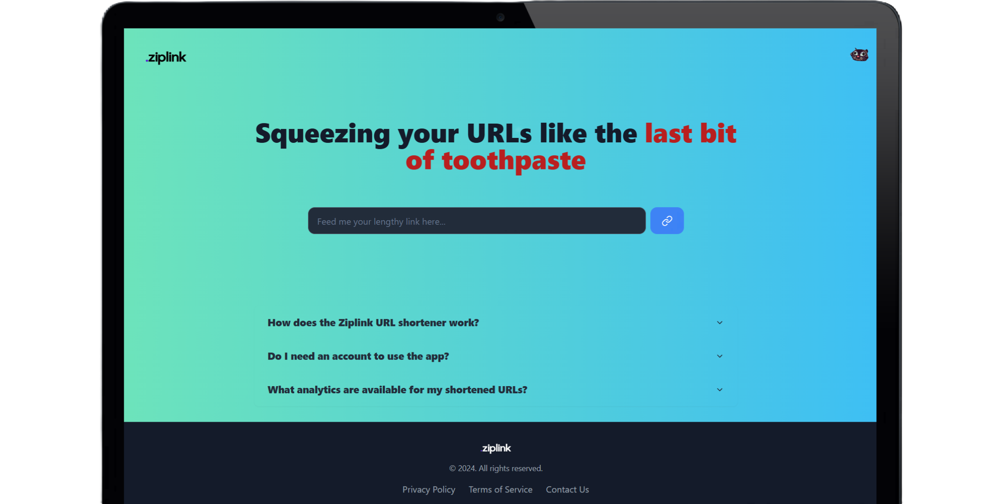

# Ziplink 🔗✨



## About 📖

Ziplink is a powerful and user-friendly URL shortener application. It allows users to create concise, shareable links from long URLs, making it easier to share links across various platforms. With integrated analytics, Ziplink provides valuable insights into link usage and performance.

## Features 🚀

- Quick URL shortening
- Custom short link creation
- Comprehensive link analytics
  - Click tracking
  - Geographical location data
  - Usage frequency statistics
- User-friendly interface with modern UI components
- Secure and reliable
- Real-time data updates
- Responsive design for all devices

## Technologies Used 💻

- React.js ⚛️ - For building the user interface
- JavaScript 🟨 - Primary programming language
- Supabase 🗄️ - Backend as a Service (BaaS) for database and authentication
- Vite ⚡ - Next-generation frontend tooling
- TailwindCSS 🎨 - For responsive and beautiful UI design
- shadcn/ui 🧩 - A collection of re-usable components built with Radix UI and Tailwind CSS

## UI Components 🎭

Ziplink utilizes shadcn/ui, a collection of beautifully designed and accessible UI components. This ensures:

- Consistent and modern look across the application
- Improved accessibility and user experience
- Faster development with pre-built, customizable components
- Seamless integration with TailwindCSS for easy styling

## Database and Backend 🔧

Ziplink uses Supabase as its primary database and backend solution. Supabase provides:

- Real-time database for storing shortened URLs and analytics data
- Authentication system for user management
- RESTful API for easy data access and manipulation
- Scalable infrastructure to handle high traffic

## Analytics Features 📊

Ziplink offers robust analytics for each shortened URL:

- Click Tracking: Monitor the number of clicks for each link
- Geographical Data: View the locations from where the links are accessed
- Time-based Analytics: Analyze usage patterns over time
- Device and Browser Information: Understand how users are accessing your links
- Referrer Tracking: See which platforms are driving traffic to your links

## Getting Started 🏁

### Prerequisites

- Node.js (v14 or later)
- npm or yarn
- Supabase account

### Installation

1. Clone the repository
   ```
   git clone https://github.com/your-username/ziplink.git
   ```

2. Navigate to the project directory
   ```
   cd ziplink
   ```

3. Install dependencies
   ```
   npm install
   ```

4. Set up environment variables
   Create a `.env` file in the root directory and add your Supabase credentials:
   ```
   VITE_SUPABASE_URL=your_supabase_project_url
   VITE_SUPABASE_ANON_KEY=your_supabase_anon_key
   ```

5. Start the development server
   ```
   npm run dev
   ```

6. Open your browser and visit `http://localhost:5173`

## Usage 🖱️

1. Sign up or log in to your Ziplink account
2. Enter a long URL in the input field
3. Click the "Shorten" button
4. Copy the generated short link
5. Share your shortened URL
6. Visit the analytics dashboard to track your link's performance

## Contributing 🤝

Contributions are welcome! Please feel free to submit a Pull Request.

## License 📄

This project is licensed under the MIT License - see the [LICENSE](LICENSE) file for details.

## Live 💻

Project Live Link: [https://ziplink-one.vercel.app]

---

Happy linking and analyzing! 📊🎉
